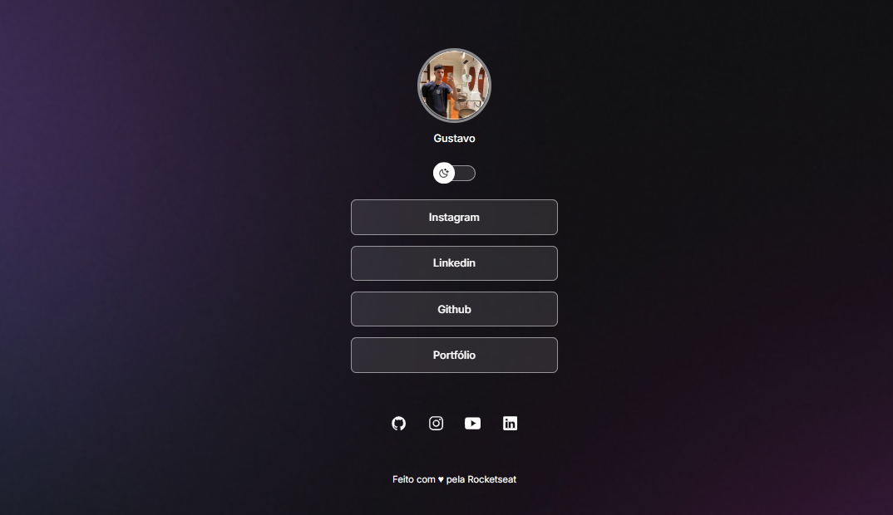

### ✨ Preview do Projeto

---

## 📖 Sobre o Projeto

Este é um agregador de links no estilo "link-in-bio", desenvolvido durante o curso Discover da **Rocketseat**. A página é totalmente responsiva e possui um interruptor para alternar entre os temas *Light* e *Dark*.

---

## 🛠️ Tecnologias e Conceitos Aplicados

-   **Design:**
    -   `Figma`: Prototipagem e design do layout.

-   **Desenvolvimento:**
    -   `HTML5`: Estruturação semântica do conteúdo.
    -   `CSS3`: Estilização com Flexbox, animações e variáveis para a troca de tema.
    -   `JavaScript`: Manipulação da DOM para a interatividade (troca de tema e de imagem).

---

## 🚀 Link do site

https://gustavomouradevbr.github.io/Projeto_linktree/

---

## 👨‍💻 Autor

Feito por **Gustavo**. Entre em contato!

-   LinkedIn: [`https://www.linkedin.com/in/gustavo-mouradev/`](https://www.linkedin.com/in/gustavo-mouradev/)
